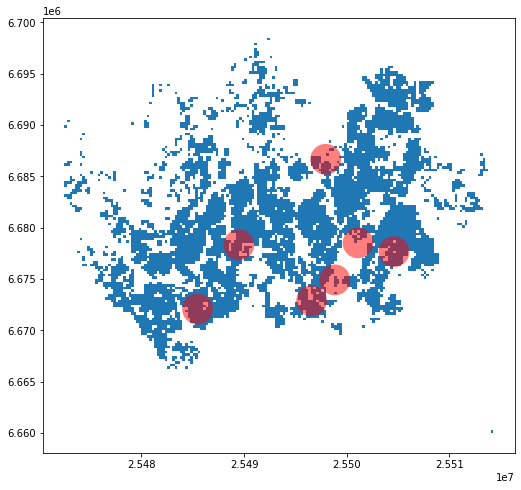
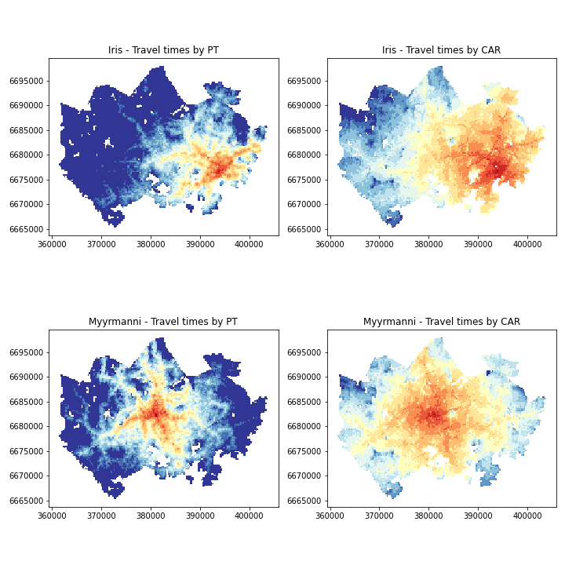
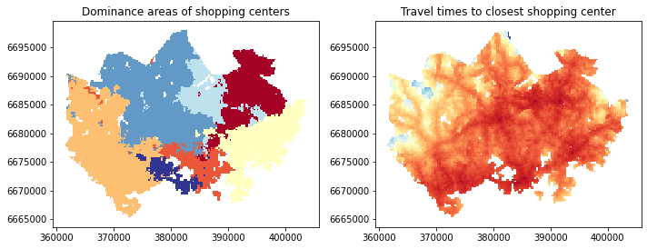
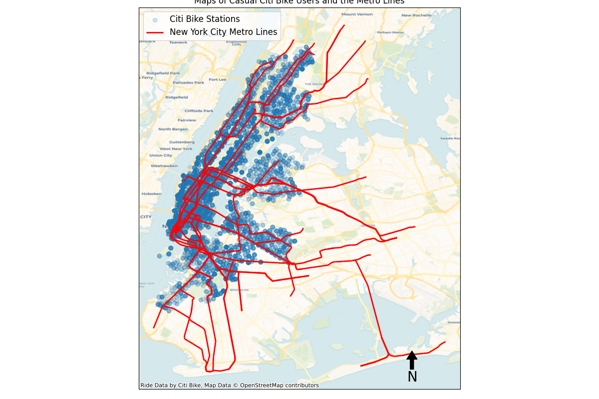

# Automating GIS Processes

This repository contains the solutions to the Exercise Sets for the Automating GIS-processes class offered by the University of Helsinki.

- __Exercise 1__: _Shapely and Geometric Objects_
    - [Problem 1-2: Creating Basic Geometries, and Attributes of Geometries](exercise_1/exercise-1-problem-1-2.ipynb)
    - [Problem 3-4: Reading Coordinates from a File and Creating Geometries, and Creating LineStrings that Represent the Movements](exercise_1/exercise-1-problem-3-4.ipynb)
- __Exercise 2__: _GeoPandas and Coordinate Reference Systems (CRS)_
    - [Problem 1: Create Polygonfrom Lists of Coordinates](exercise_2/Exercise-2-problem-1.ipynb)
    - [Problem 2: Points to Map](exercise_2/Exercise-2-problem-2.ipynb)
    - [Problem 3: Calculate Distance travelled](exercise_2/Exercise-2-problem-3.ipynb)  
- __Exercise 3__: _Geocoding, Spatial Queries and Joins_
    - [Problem 1-3: Geocode Shopping Centers, Create Buffers around Shopping Centers, and Calculate the Population around Shopping Centers](exercise_3/Exercise-3-Problem-1-3.ipynb)
        
    - [Problem 4: Calculate Closest Shopping Center from Locations](exercise_3/Exercise-3-Problem-4.ipynb)
- __Exercise 4__: _Geometric Operations and Data Reclassification_
    - [Problem 1: Join Different Datasets and Create Maps](exercise_4/Exercise-4-problem-1.ipynb)
        
    - [Problem 2: Calculate and Visualize the Dominance Areas of Shopping Centers](exercise_4/Exercise-4-problem-2.ipynb)
        
    - [Problem 3: Calculate the Population of the Dominance Areas of each Shopping Center](exercise_4/Exercise-4-problem-3.ipynb)
- __Exercise 5__: _Static Maps and Sharing Interactive Plots in Github_
    - [Problem 1: Visualize a Static Map](exercise_5/Exercise-5-problem-1.ipynb)
        